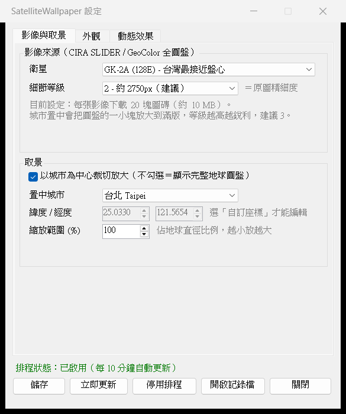
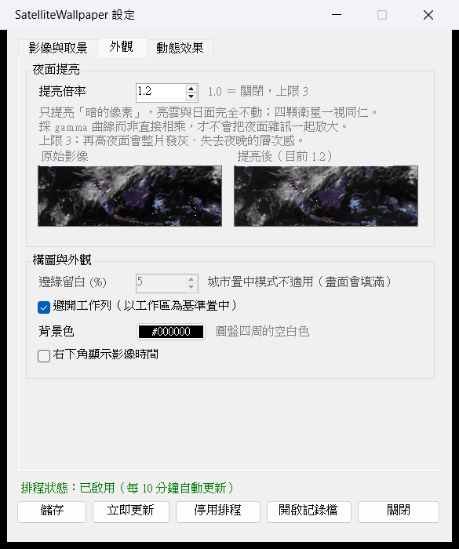
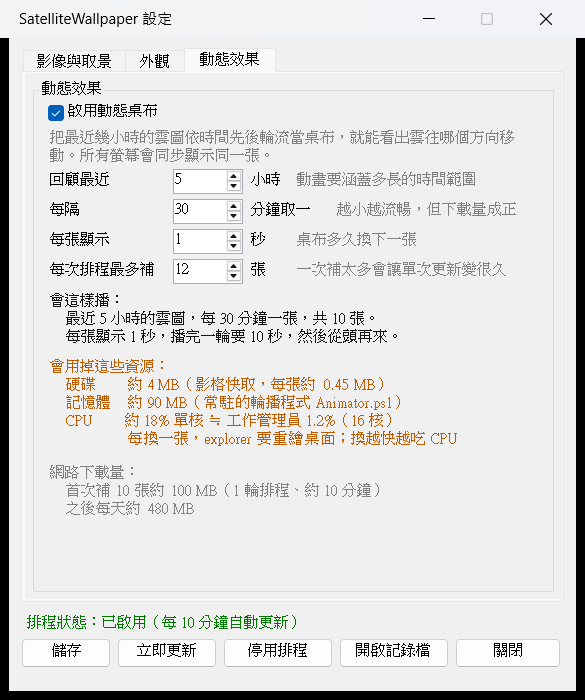

# SatelliteWallpaper

**把 Windows 桌布換成真正的即時衛星雲圖，每 10 分鐘自動更新。**

不用註冊、不用 API key、不用付費、不用裝任何額外軟體。下載解壓、雙擊一個檔案就好。

*Turn your Windows desktop into live satellite imagery of Earth, updated every 10 minutes. No account, no API key, no install.*


*實際桌布輸出。台灣時間 22:00，整個盤面都在夜側——雲、颱風、城市燈光、月光下的澳洲一應俱全，而不是一片漆黑*


*同一天 18:30，晨昏線橫過盤面*

---

## 安裝：三個步驟

### 1. 下載

在本頁按綠色的 **`Code`** 按鈕 → **`Download ZIP`**，然後解壓縮到任何一個你有權限寫入的資料夾（例如 `文件\SatelliteWallpaper`）。

> ⚠️ 別放進 `C:\Program Files`，那裡需要系統管理員權限。
>
> ⚠️ 從網路下載的 ZIP，Windows 有時會封鎖。如果解壓後執行沒反應：對著 **ZIP 檔**按右鍵 →「內容」→ 勾選最下面的「**解除封鎖**」→ 確定，再重新解壓縮一次。

### 2. 雙擊 `Settings.vbs`

設定視窗會打開。不會跳出黑色的命令列視窗，這是正常的。


*第一個分頁「影像與取景」。預設值就能直接用，不改任何東西也沒關係*

### 3. 按「啟用排程」，再按「立即更新」

底下的狀態列會變成綠色的「排程狀態：已啟用」，大約幾十秒後桌布就換好了。

**完成。** 之後每 10 分鐘會自動更新，開機後也會繼續，不需要再做任何事。

---

## 設定視窗怎麼用

視窗有三個分頁。每改一個選項，畫面上就會即時告訴你「這樣會下載多少、佔用多少」，不用自己算。

改完記得按 **「儲存」**，再按 **「立即更新」** 馬上看效果。

### 影像與取景（上圖）

| 選項 | 白話說明 |
|---|---|
| **衛星** | 選離你想看的地區最近的那一顆。**台灣、東亞選 GK-2A**（預設）；日本選 Himawari-9；美洲選 GOES-19／GOES-18。 |
| **細節等級** | 就是畫質。等級越高越清晰，但下載量呈 4 倍成長。**看完整地球時選 2 就夠了**，選 3 幾乎看不出差別卻要多下載 4 倍。放大到某座城市時才建議調到 3。 |
| **以城市為中心裁切放大** | **打勾** = 只看某座城市附近，畫面填滿整個螢幕。<br>**不打勾** = 看完整的地球圓盤。 |
| **置中城市** | 內建常見城市；選「自訂座標」可以自己填經緯度。 |
| **縮放範圍 (%)** | 畫面要涵蓋地球直徑的百分之幾。**數字越小放得越大**。 |

### 外觀



| 選項 | 白話說明 |
|---|---|
| **提亮倍率** | 夜晚那半邊本來就很暗，這個把「暗的地方」調亮，**亮的雲和白天完全不動**。`1.0` = 關閉，**上限 3**——再高整片夜面會發灰、失去層次。旁邊有即時的前後對照圖，拉動數字就看得到差別。 |
| **邊緣留白 (%)** | 地球和螢幕邊緣要留多少空間。**數字越小，地球看起來越大**。只有在「不」勾城市置中時才有作用（勾了就會停用並標示原因）。 |
| **避開工作列** | 以扣掉工作列後的可視範圍置中，地球不會被工作列切到。 |
| **背景色** | 圓盤四周空白處的顏色。 |
| **右下角顯示影像時間** | 在桌布角落標上這張圖是幾點拍的。 |

### 動態效果



打勾以後，程式會把**最近幾小時的雲圖存起來，然後輪流當桌布**——看著桌布就能發現雲往哪個方向移動。所有螢幕會同步顯示同一張。

下方會即時算出這樣設定的實際代價。注意這是三種**不同**的資源，別搞混：

- **硬碟**：存下來的雲圖檔案共佔幾 MB
- **記憶體**：負責換圖的小程式常駐佔用多少
- **CPU**：每換一張桌布，Windows 要重繪整個桌面，換越快越吃 CPU

另外還會估算**網路下載量**：首次補齊要多久、之後每天大約下載多少。

> **這是「定時換圖」，不是連續播放的影片。** 它讓你看出雲的走向，但不會像新聞畫面那樣流動。原因見下方〈為什麼不是連續動畫〉。

---

## 常見問題

<details>
<summary><b>桌布沒有變，怎麼辦？</b></summary>

打開 `Settings.vbs`，按 **「開啟記錄檔」**，最後幾行會寫失敗的原因。最常見的是暫時連不上影像伺服器，等下一輪 10 分鐘通常就好了。
</details>

<details>
<summary><b>為什麼晚上看得到雲？別的工具晚上都是一片黑</b></summary>

因為用的是 **GeoColor** 這種合成影像：白天是真彩色，入夜後自動改用紅外線呈現雲層，再疊上城市燈光。日夜之間是連續漸變的，不需要在兩種來源之間切換，也就不會有接縫。
</details>

<details>
<summary><b>可以讓地球「轉動」，讓我的城市出現在球體正中央嗎？</b></summary>

**不行。** 這是物理限制，不是程式做不到。這些是地球同步衛星，永遠固定在赤道上空同一個位置看同一個半球，拍不到別的角度。

所以「城市置中」是**裁切放大**——把圓盤上的那一小塊放大到滿版，不是轉動球體。

想讓台灣更接近盤面中心，就選 **GK-2A**（星下點 128°E，台灣偏離盤心約 50% 半徑），比 Himawari-9（140.7°E，59%）好一些。
</details>

<details>
<summary><b>會佔用多少網路流量？</b></summary>

只用靜態桌布的話很少——細節等級 2 的完整圓盤每 10 分鐘約 10 MB。

**開啟動態效果會大幅增加**，因為要補齊好幾小時的歷史影像。設定視窗會直接算給你看每天大概多少 MB。影像來自科羅拉多州立大學 CIRA 的公開研究網站，請斟酌使用，這也是基本禮貌。
</details>

<details>
<summary><b>怎麼完全移除？</b></summary>

1. 打開 `Settings.vbs` → 按 **「停用排程」**
2. 如果開過動態效果，把「啟用動態桌布」取消打勾 → 按「儲存」（會一併移除開機自動啟動）
3. 刪掉整個資料夾
4. 想清乾淨的話，再刪掉 `%LOCALAPPDATA%\SatelliteWallpaper`（貼到檔案總管網址列即可前往）

桌布不會自動變回原本那張，自己換一張就好。
</details>

<details>
<summary><b>更新版本後，我的設定會不會被蓋掉？</b></summary>

不會。你的設定存在 `config.json`，這個檔案**不在版本控制內**。倉庫裡只有範本 `config.example.json`，第一次執行時才複製一份給你。
</details>

<details>
<summary><b>需要什麼系統？要開管理員權限嗎？</b></summary>

Windows 10 或 11，內建的 PowerShell 就夠了。**全程不需要系統管理員權限**——排程工作以你自己的身分建立。
</details>

---

## 給進階使用者

<details>
<summary><b>命令列用法</b></summary>

```powershell
# 開啟設定視窗（建議雙擊 Settings.vbs，不會閃出主控台）
.\Settings.ps1

# 安裝：建立每 10 分鐘執行的排程工作，並立即更新一次
.\Install-Task.ps1

# 自訂間隔（例如每 20 分鐘）
.\Install-Task.ps1 -IntervalMinutes 20

# 手動更新一次
powershell -NoProfile -ExecutionPolicy Bypass -File .\Update-Wallpaper.ps1

# 移除排程
.\Uninstall-Task.ps1

# 強制立即重新下載（清除戳記後手動觸發排程）
Remove-Item "$env:LOCALAPPDATA\SatelliteWallpaper\last-image.txt"; schtasks /Run /TN SatelliteWallpaper

# 查看執行紀錄
Get-Content "$env:LOCALAPPDATA\SatelliteWallpaper\log.txt" -Tail 20
```

**檔案位置**

- 產出的桌布與紀錄：`%LOCALAPPDATA%\SatelliteWallpaper\`（`wallpaper.bmp`、`log.txt`）
- 動畫影格：`%LOCALAPPDATA%\SatelliteWallpaper\frames\`（`frame_*.jpg` 與記錄目前構圖的 `composition.txt`）
</details>

<details>
<summary><b>影像來源</b></summary>

全部取自 **CIRA SLIDER** 的 `geocolor` 全圓盤產品，免註冊、免 API key：

| `Source` | 衛星 | 星下點 | 適合 |
|---|---|---|---|
| `gk2a`（預設） | GEO-KOMPSAT-2A | 128.0°E | 台灣、東亞（台灣最接近盤心） |
| `himawari` | Himawari-9 | 140.69°E | 日本、西太平洋 |
| `goes19` | GOES-19 | 75.2°W | 美洲東部 |
| `goes18` | GOES-18 | 137°W | 太平洋東部 |

更新頻率均為 10 分鐘。**GeoColor 是多光譜合成產品**：日間為真彩、夜間改以紅外線呈現雲層並疊上靜態城市燈光，因此夜面看得到雲，而不是一片黑。
</details>

<details>
<summary><b>config.json 欄位</b></summary>

`config.json` 是**個人設定、不進版控**（列在 `.gitignore`）。倉庫裡只放範本 `config.example.json`，首次執行 `Update-Wallpaper.ps1` 或開啟設定視窗時會自動複製一份，之後怎麼改都不會與 repo 衝突。範本的預設值刻意保守：全圓盤、動態桌布關閉，不會一裝好就開始大量下載。

| 欄位 | 說明 |
|------|------|
| `Source` | `gk2a` / `himawari` / `goes19` / `goes18` |
| `DetailLevel` | 1～4，對應 SLIDER 的 zoom 等級（約 1400 / 2750 / 5500 / 11000 px）。**全圓盤模式封頂在 3**，等級 4 需要 256 塊圖磚而畫面上看不出差別 |
| `CityCentering` | 是否以城市為中心裁切放大；不啟用則顯示完整圓盤 |
| `CenterCity` | 城市代碼，`Custom` 時用下面兩個座標 |
| `CenterLat` / `CenterLon` | 置中座標 |
| `CityZoomPercent` | 取景寬度佔地球直徑的比例，數字越小放越大 |
| `MarginPercent` | 圓盤與螢幕邊緣的留白比例（%）。**僅未啟用城市置中時有意義** |
| `AvoidTaskbar` | 以工作區（螢幕扣掉工作列）為基準置中 |
| `NightBoost` | 夜面提亮倍率。`1.0` = 原始影像；預設 `1.5` |
| `BackgroundColor` | 背景色（HTML 色碼） |
| `ShowTimestamp` | 是否在右下角顯示影像時間 |
| `AnimationEnabled` | 啟用動態桌布 |
| `AnimationHours` | 動畫涵蓋最近幾小時（上限 16） |
| `AnimationStepMinutes` | 影格之間的時間間隔（分，10 的倍數） |
| `AnimationIntervalSec` | 播放時每張停留幾秒 |
| `AnimationBackfillPerRun` | 每次排程最多補幾張歷史影格 |
</details>

<details>
<summary><b>運作原理</b></summary>

### 取景與投影

SLIDER 自己的產品定義檔公布了每顆衛星的投影常數（星下點經度、掃描角半徑、zoom 0 的圓盤半徑像素），`Update-Wallpaper.ps1` 頂端的 `$Sats` 表就是照抄那份定義。經緯度先換算成地心座標、再投影成掃描角、最後換成圓盤像素，即可精確定位任意城市。

**只下載需要的圖磚**：影像是 688×688（GOES 為 678）的圖磚金字塔，程式先算出取景矩形涵蓋哪幾塊才去抓。以等級 3 的台北取景為例，全圓盤共 64 塊、實際只需要 **9 塊**。

### 日夜

不做任何日夜判斷。GeoColor 本身就處理好了晨昏線，切換來源或疊圖反而會製造接縫。`NightBoost` 只是把暗部做亮度加權的 gamma 提升（`ImageOps.cs`），日面與晨昏線不受影響。

### 動態桌布

影格檔名帶影像時間（`frame_<UTC時間戳>.jpg`），每次排程會：

1. 從 `latest_times.json` 取得可用時刻，依 `AnimationStepMinutes` 挑出想要的時間點
2. 刪掉視窗外的舊影格
3. 補上缺少的影格（每輪上限 `AnimationBackfillPerRun`，由新到舊）

所以**啟用後不必等好幾小時才有動畫**，數輪排程內就會補滿。桌布與影格走的是同一條合成路徑，兩者構圖不會漂移。

輪播由常駐的 `Animator.ps1` 以 `IDesktopWallpaper::SetWallpaper(null, path)` 套到**所有螢幕**，而**不使用** Windows 內建投影片放映——實測後者有兩個無法繞過的限制：間隔低於 10 秒會被無聲改成 10 秒，且多螢幕時每個螢幕會各自輪播不同影像。

資源用量（1920×1080 主螢幕實測值）：

| 資源 | 用量 | 說明 |
|---|---|---|
| 硬碟 | 每張影格約 **0.45 MB** | JPG 快取在 `frames\`，張數 = 涵蓋時數 ÷ 影像間隔 |
| 記憶體 | 約 **90 MB** | 常駐的 `Animator.ps1`（PowerShell 行程 WorkingSet） |
| CPU | 1 秒間隔約 **18.4% 單核** | 每換一張桌布 explorer.exe 要重繪整個桌面，約 0.18 核心秒；間隔 N 秒時約為 18.4/N % |

CPU 實測方法：取 explorer.exe 的 `TotalProcessorTime` 增量除以牆鐘時間，播放中 19.0%、閒置基準 0.5%。注意「% 單核」與工作管理員顯示的整體 CPU 不同——16 核機器上 18.4% 單核只等於工作管理員的約 1.2%。

> **時間戳不可自行推算**：Himawari／GK-2A 落在整 10 分鐘，GOES 則帶秒數偏移（如 `20260725121020`），所以一律以 `latest_times.json` 為準。該檔只給最近 100 個時刻，這也是 `AnimationHours` 上限 16 小時的原因。
</details>

<details>
<summary><b>為什麼不是連續動畫</b></summary>

實測結論（Windows 11 build 26200）：

- 桌布 API（`SystemParametersInfo` / `IDesktopWallpaper`）每次切換都會讓 explorer 重寫 `TranscodedWallpaper` 並重繪桌面，1 秒間隔約佔 20% 單核。**這條路做不到 10 fps 以上**
- Wallpaper Engine 式的做法是自建視窗掛到桌面圖層。實測**網路上通行的 `0x052C` → WorkerW → `SetParent` 在此版本無效**（覆蓋率 0%）：WorkerW 是 Progman 的**子視窗**，`EnumWindows` 只列頂層視窗故永遠找不到；且直接畫進 Progman／WorkerW 的 DC 也不會上螢幕
- 改掛到 `SHELLDLL_DefView`（或自建最底層 top-level 視窗）**可以**渲染，`BitBlt` 實測 1920×1080 達 818 fps、三螢幕 3840×1980 達 231 fps，JPEG 解碼 5.9 ms/張——**效能完全不是瓶頸**
- 但這樣會蓋住桌面圖示；強制重繪 `SysListView32` 雖然讓圖示回來，卻會把自繪畫面洗掉

因此本專案目前不內建連續動畫。若要真正的流動效果，建議把影格交給 [Lively Wallpaper](https://github.com/rocksdanister/lively) 之類已經處理好各版本 Windows 差異的工具。
</details>

<details>
<summary><b>已知限制</b></summary>

- 只處理主螢幕（多螢幕會由 Windows 以「填滿」樣式套用同一張圖）
- **SLIDER 沒有正式 API 合約**：那是 CIRA 的公開研究網站，沒有 SLA，改版時圖磚路徑或投影常數可能變動。網址樣板與常數集中在 `Update-Wallpaper.ps1` 頂端，需要時只改該處
- 動畫回填會放大流量：全圓盤等級 2 每張約 8 MB，24 張約 190 MB
- **地球同步衛星無法「轉動球體」**（見上方常見問題）
- 動態桌布仍是「換圖」而非連續動畫
</details>

---

## 授權與資料來源

程式碼採 [MIT](LICENSE) 授權。影像資料版權歸屬各機構：

- **CIRA/RAMMB, Colorado State University** — GeoColor 產品與 SLIDER 服務
- **KMA 韓國氣象廳 기상청**（GK-2A）、**JMA 氣象庁**（Himawari-9）、**NOAA**（GOES-19/18）— 原始觀測資料

GeoColor 由 CIRA 開發。個人非商業使用請註明來源。
