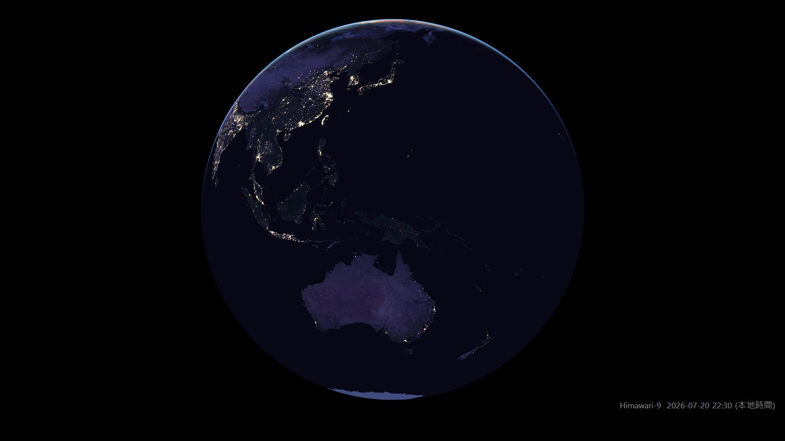
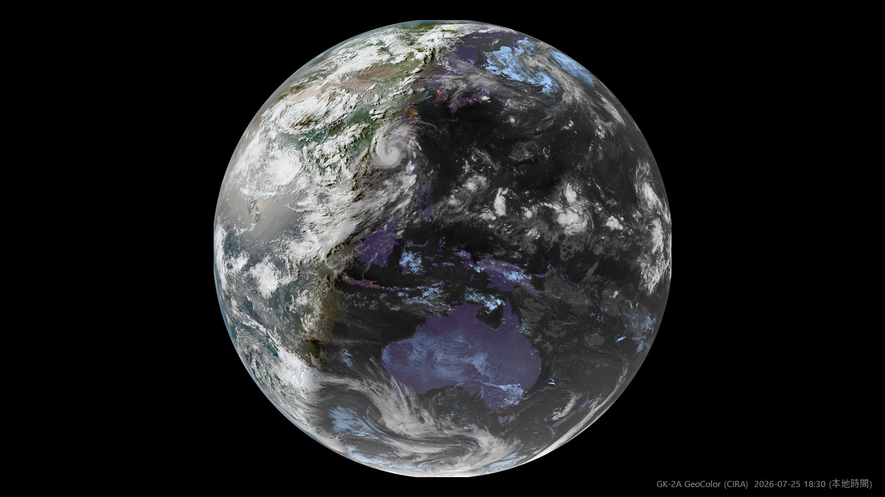

# SatelliteWallpaper

> An EarthDesk-style Windows wallpaper updater in pure PowerShell + embedded C#: every 10 minutes it fetches the latest GeoColor full-disk imagery from CIRA SLIDER (GK-2A, Himawari-9, GOES-19/18) and renders it as your desktop — a true globe by day *and* by night, with real infrared cloud cover and city lights after dark.

類似 EarthDesk 的個人小工具：定時把 Windows 桌布換成最新的衛星雲圖。純 PowerShell + 內嵌 C#，無任何外部相依、不需註冊任何服務。


*實際桌布輸出。台灣時間 22:00，整個盤面都在夜側——雲、颱風、城市燈光、月光下的澳洲一應俱全，而不是一片漆黑*


*同一天 18:30，晨昏線橫過盤面。GeoColor 的日夜過渡是連續的，不需要在兩種來源之間切換*

## 功能

- **完整地球圓盤**：日夜都是同一顆球體，不會因為入夜就變成局部矩形圖
- **夜間真實雲圖**：GeoColor 的夜側是紅外線雲層 + 城市燈光，晨昏線連續漸變，不需要判斷日夜或切換來源
- **台灣／任意城市置中**：以地球同步軌道透視投影把經緯度換算成圓盤像素，裁切放大
- **動態桌布**：自動回填最近數小時的影像，依時間順序輪播
- **設定視窗**：不必手改 JSON，圖形介面即可調整所有選項與排程

## 影像來源

全部取自 **CIRA SLIDER** 的 `geocolor` 全圓盤產品，免註冊、免 API key：

| `Source` | 衛星 | 星下點 | 適合 |
|---|---|---|---|
| `gk2a`（預設） | GEO-KOMPSAT-2A | 128.0°E | 台灣、東亞（台灣最接近盤心） |
| `himawari` | Himawari-9 | 140.69°E | 日本、西太平洋 |
| `goes19` | GOES-19 | 75.2°W | 美洲東部 |
| `goes18` | GOES-18 | 137°W | 太平洋東部 |

更新頻率均為 10 分鐘。**GeoColor 是多光譜合成產品**：日間為真彩、夜間改以紅外線呈現雲層並疊上靜態城市燈光，因此夜面看得到雲，而不是一片黑。

## 使用方式

```powershell
# 開啟設定視窗（建議連按 Settings.vbs，不會閃出主控台）
.\Settings.ps1

# 安裝（建立每 10 分鐘執行的排程工作，並立即更新一次）
.\Install-Task.ps1

# 自訂間隔（例如每 20 分鐘）
.\Install-Task.ps1 -IntervalMinutes 20

# 手動更新一次
powershell -NoProfile -ExecutionPolicy Bypass -File .\Update-Wallpaper.ps1

# 移除
.\Uninstall-Task.ps1
```

## 設定 (config.json)

`config.json` 是**個人設定、不進版控**（列在 `.gitignore`）。倉庫裡只放範本 `config.example.json`，首次執行 `Update-Wallpaper.ps1` 或開啟設定視窗時會自動複製一份，之後怎麼改都不會與 repo 衝突。

範本的預設值刻意保守：全圓盤、動態桌布關閉，不會一裝好就開始大量下載。

| 欄位 | 說明 |
|------|------|
| `Source` | `gk2a` / `himawari` / `goes19` / `goes18` |
| `DetailLevel` | 1～4，對應 SLIDER 的 zoom 等級（約 1400 / 2750 / 5500 / 11000 px）。**全圓盤模式封頂在 3**，等級 4 需要 256 塊圖磚而畫面上看不出差別 |
| `CityCentering` | 是否以城市為中心裁切放大；不啟用則顯示完整圓盤 |
| `CenterCity` | 城市代碼，`Custom` 時用下面兩個座標 |
| `CenterLat` / `CenterLon` | 置中座標 |
| `CityZoomPercent` | 取景寬度佔地球直徑的比例，數字越小放越大 |
| `MarginPercent` | 圓盤與螢幕邊緣的留白比例（%）。**僅未啟用城市置中時有意義** |
| `AvoidTaskbar` | 以工作區（螢幕扣掉工作列）為基準置中 |
| `NightBoost` | 夜面提亮倍率。`1.0` = 原始影像；預設 `1.5` |
| `BackgroundColor` | 背景色（HTML 色碼） |
| `ShowTimestamp` | 是否在右下角顯示影像時間 |
| `AnimationEnabled` | 啟用動態桌布 |
| `AnimationHours` | 動畫涵蓋最近幾小時（上限 16，見下方說明） |
| `AnimationStepMinutes` | 影格之間的時間間隔（分，10 的倍數） |
| `AnimationIntervalSec` | 播放時每張停留幾秒 |
| `AnimationBackfillPerRun` | 每次排程最多補幾張歷史影格 |

## 運作原理

### 取景與投影

SLIDER 自己的產品定義檔公布了每顆衛星的投影常數（星下點經度、掃描角半徑、zoom 0 的圓盤半徑像素），`Update-Wallpaper.ps1` 頂端的 `$Sats` 表就是照抄那份定義。經緯度先換算成地心座標、再投影成掃描角、最後換成圓盤像素，即可精確定位任意城市。

**只下載需要的圖磚**：影像是 688×688（GOES 為 678）的圖磚金字塔，程式先算出取景矩形涵蓋哪幾塊才去抓。以等級 3 的台北取景為例，全圓盤共 64 塊、實際只需要 **9 塊**。

### 日夜

不做任何日夜判斷。GeoColor 本身就處理好了晨昏線，切換來源或疊圖反而會製造接縫。`NightBoost` 只是把暗部做亮度加權的 gamma 提升（`ImageOps.cs`），日面與晨昏線不受影響。

### 動態桌布

影格檔名帶影像時間（`frame_<UTC時間戳>.jpg`），每次排程會：

1. 從 `latest_times.json` 取得可用時刻，依 `AnimationStepMinutes` 挑出想要的時間點
2. 刪掉視窗外的舊影格
3. 補上缺少的影格（每輪上限 `AnimationBackfillPerRun`，由新到舊）

所以**啟用後不必等好幾小時才有動畫**，數輪排程內就會補滿。桌布與影格走的是同一條合成路徑，兩者構圖不會漂移。

輪播由常駐的 `Animator.ps1` 以 `IDesktopWallpaper::SetWallpaper(null, path)` 套到**所有螢幕**，而**不使用** Windows 內建投影片放映——實測後者有兩個無法繞過的限制：間隔低於 10 秒會被無聲改成 10 秒，且多螢幕時每個螢幕會各自輪播不同影像。

動態桌布會用掉三種**不同**的資源，設定視窗會分開列出（以下為 1920×1080 主螢幕實測值）：

| 資源 | 用量 | 說明 |
|---|---|---|
| 硬碟 | 每張影格約 **0.45 MB** | JPG 快取在 `frames\`，張數 = 涵蓋時數 ÷ 影像間隔 |
| 記憶體 | 約 **90 MB** | 常駐的 `Animator.ps1`（PowerShell 行程 WorkingSet） |
| CPU | 1 秒間隔約 **18.4% 單核** | 每換一張桌布 explorer.exe 要重繪整個桌面，約 0.18 核心秒；間隔 N 秒時約為 18.4/N % |

CPU 實測方法：取 explorer.exe 的 `TotalProcessorTime` 增量除以牆鐘時間，播放中 19.0%、閒置基準 0.5%。注意「% 單核」與工作管理員顯示的整體 CPU 不同——16 核機器上 18.4% 單核只等於工作管理員的約 1.2%。

> **時間戳不可自行推算**：Himawari／GK-2A 落在整 10 分鐘，GOES 則帶秒數偏移（如 `20260725121020`），所以一律以 `latest_times.json` 為準。該檔只給最近 100 個時刻，這也是 `AnimationHours` 上限 16 小時的原因。

## 限制

- 只處理主螢幕（多螢幕會由 Windows 以「填滿」樣式套用同一張圖）
- **SLIDER 沒有正式 API 合約**：那是 CIRA 的公開研究網站，沒有 SLA，改版時圖磚路徑或投影常數可能變動。網址樣板與常數集中在 `Update-Wallpaper.ps1` 頂端，需要時只改該處
- 動畫回填會放大流量：全圓盤等級 2 每張約 8 MB，24 張約 190 MB。請斟酌 `AnimationHours`／`AnimationStepMinutes`，也是對 CIRA 的基本禮貌
- **地球同步衛星無法「轉動球體」**：衛星永遠從同一角度看同一個半球，因此城市只能靠裁切放大置中，無法讓任意城市出現在**球體**正中央。想讓台灣更接近盤心就選 GK-2A（128°E，偏離 50% 半徑）而非 Himawari（140.7°E，59%）
- 動態桌布仍是「換圖」而非連續動畫，原因見下

### 關於「像新聞那樣流動的雲」

實測結論（Windows 11 build 26200）：

- 桌布 API（`SystemParametersInfo` / `IDesktopWallpaper`）每次切換都會讓 explorer 重寫 `TranscodedWallpaper` 並重繪桌面，1 秒間隔約佔 20% 單核。**這條路做不到 10 fps 以上**
- Wallpaper Engine 式的做法是自建視窗掛到桌面圖層。實測**網路上通行的 `0x052C` → WorkerW → `SetParent` 在此版本無效**（覆蓋率 0%）：WorkerW 是 Progman 的**子視窗**，`EnumWindows` 只列頂層視窗故永遠找不到；且直接畫進 Progman／WorkerW 的 DC 也不會上螢幕
- 改掛到 `SHELLDLL_DefView`（或自建最底層 top-level 視窗）**可以**渲染，`BitBlt` 實測 1920×1080 達 818 fps、三螢幕 3840×1980 達 231 fps，JPEG 解碼 5.9 ms/張——**效能完全不是瓶頸**
- 但這樣會蓋住桌面圖示；強制重繪 `SysListView32` 雖然讓圖示回來，卻會把自繪畫面洗掉

因此本專案目前不內建連續動畫。若要真正的流動效果，建議把影格交給 [Lively Wallpaper](https://github.com/rocksdanister/lively) 之類已經處理好各版本 Windows 差異的工具。

### 設定視窗

分成「影像與取景 / 外觀 / 動態效果」三個分頁，除了改設定，也會即時算出目前選擇的代價：

- **夜面提亮**附**即時 before / after 對照圖**（素材 `assets/night-sample.jpg`，未提亮的夜面實拍），拉動倍率即可看到效果
- **細節等級**顯示每張要下載幾塊圖磚、多少 MB；在全圓盤模式選到等級 3 會明確警告「與等級 2 幾乎無差別、但流量 4 倍」
- **動態效果**以白話說明會怎麼播（幾張、一輪幾秒），並估算首次補齊時間與**每日下載量**；超過 1 GB/天會提醒這對 CIRA 是實質負擔
- 不適用的欄位一律停用並說明原因（例如城市置中時「邊緣留白」會停用並標示「畫面會填滿」）

## 檔案位置

- 產出的桌布與紀錄：`%LOCALAPPDATA%\SatelliteWallpaper\`（`wallpaper.bmp`、`log.txt`）
- 動畫影格：`%LOCALAPPDATA%\SatelliteWallpaper\frames\`（`frame_*.jpg` 與記錄目前構圖的 `composition.txt`）

## 疑難排解

```powershell
# 強制立即重新下載並更新（清除戳記後手動觸發排程）
Remove-Item "$env:LOCALAPPDATA\SatelliteWallpaper\last-image.txt"; schtasks /Run /TN SatelliteWallpaper

# 查看執行紀錄
Get-Content "$env:LOCALAPPDATA\SatelliteWallpaper\log.txt" -Tail 20
```

## 授權

[MIT](LICENSE)。影像資料版權歸屬各機構：

- **CIRA/RAMMB, Colorado State University** — GeoColor 產品與 SLIDER 服務
- **KMA 韓國氣象廳 기상청**（GK-2A）、**JMA 氣象庁**（Himawari-9）、**NOAA**（GOES-19/18）— 原始觀測資料

GeoColor 由 CIRA 開發。個人非商業使用請註明來源。
